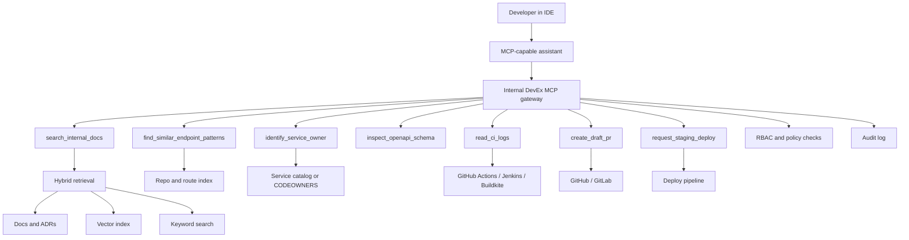

Most AI coding demos look impressive for about five minutes.

Ask an assistant to write a function, explain a stack trace, or generate a unit test and it usually does fine. The harder question is what happens inside a real engineering organization, where the task is not "write some code" but:

- Which service owns this API?
- What is our internal response envelope?
- Which OpenAPI file needs to change?
- What auth check is required?
- Which existing endpoint should I copy?
- Which CI logs explain this failure?
- Who should review this PR?
- Is this safe to deploy to staging?

That is where an internal DevEx MCP platform becomes interesting.

The goal is not to make the model "know everything." The goal is to let the model ask the company the right questions through narrow, typed, permissioned tools.

That is the architectural shift:

```text
generic code generation
-> company-aware engineering automation
```

## The problem with generic coding assistants

Public AI coding assistants are useful, but generic by definition.

They know the public internet's version of:

- TypeScript
- Python
- React
- Docker
- REST
- Kubernetes
- AWS
- unit testing

They do not know your private engineering system:

- service ownership
- internal API standards
- auth middleware
- feature flag conventions
- OpenAPI layout
- CI job structure
- flaky test history
- deployment policy
- incident runbooks
- compliance constraints
- code owners
- internal docs

That is the difference between these two requests:

```text
"Generate a REST endpoint."
```

and:

```text
"Add GET /vendors/:vendorId/risk-status to vendor-service,
follow our API conventions, update OpenAPI, add tests,
include auth checks, and open a draft PR."
```

The first request is about text generation.

The second is about engineering workflow execution.

## Why MCP fits this problem

MCP, the Model Context Protocol, is a good fit because it gives the assistant a standard way to call tools instead of pretending everything should fit into prompt text.

That matters because the safe version of internal AI is not:

```text
Give the model the entire wiki, the repo, CI, and shell access.
```

It is:

```text
Expose narrow tools with schemas, permissions, and audit logs.
```

This is the key design principle:

| Bad surface | Better surface |
|---|---|
| "Read anything in Confluence" | `search_internal_docs(query, serviceName, docType)` |
| "Run arbitrary shell commands" | `run_tests(command, args)` |
| "Open the production database" | `inspect_openapi_schema(serviceName, path)` |
| "Look around GitHub and figure it out" | `find_similar_endpoint_patterns(resource, action, method)` |
| "Push code directly" | `create_draft_pr(branchName, title, body)` |

The MCP server is not "the AI." It is the controlled boundary between the model and company systems.

## High-level architecture



A good internal platform usually has four layers:

1. The assistant in the IDE.
2. The MCP gateway that exposes the tool contract.
3. The retrieval and workflow tools behind that contract.
4. The company systems those tools connect to.

The gateway is where the engineering discipline lives:

- authentication
- RBAC
- rate limiting
- redaction
- logging
- approval boundaries

Without that layer, you do not have a platform. You have a clever demo with too much access.

## The first tools that actually matter

Teams often over-design the tool surface. They imagine 40 tools before they have validated 4.

In practice, the first wave should be boring and high leverage.

| Tool | What it unlocks | Backing system |
|---|---|---|
| `search_internal_docs` | API rules, runbooks, specs, onboarding | Confluence, Notion, ADRs, docs repo |
| `find_similar_endpoint_patterns` | Copy existing conventions instead of inventing new ones | repo index, route parser, OpenAPI registry |
| `identify_service_owner` | Reviewer routing and ownership clarity | Backstage, service catalog, CODEOWNERS |
| `inspect_openapi_schema` | Prevent schema drift and style invention | OpenAPI files in repos |
| `read_ci_logs` | Faster failure diagnosis | GitHub Actions, Jenkins, Buildkite |
| `create_draft_pr` | Close the loop safely without auto-merging | GitHub or GitLab |

That set already covers a surprising amount of daily engineering pain.

It helps with:

- adding endpoints
- following internal standards
- debugging CI
- finding the right owning team
- opening a reviewable PR instead of stopping at a code diff

## Example workflow: adding an API

Suppose a developer asks:

```text
Add GET /vendors/:vendorId/risk-status to vendor-service
following our internal API conventions.
```

The assistant should not jump straight into code generation. It should gather constraints first:

```text
1. identify_service_owner("vendor-service")
2. inspect_openapi_schema("vendor-service")
3. find_similar_endpoint_patterns(resource="vendor", action="risk status", method="GET")
4. search_internal_docs(query="vendor API guidelines", serviceName="vendor-service")
5. generate code changes locally
6. run_tests(...)
7. create_draft_pr(...)
```

The value is not that the model wrote a controller.

The value is that it worked inside the real engineering system:

- copied the right pattern
- updated the right schema file
- followed the right auth rule
- suggested the right reviewers
- produced a draft PR instead of a disconnected code snippet

That is the difference between a chatbot and a DevEx platform.

## Retrieval is not one thing

One of the easiest design mistakes is treating every question like a vector search problem.

That is wrong for internal engineering systems because different information needs different retrieval modes.

| Question | Best retrieval mode |
|---|---|
| "What are our API response conventions?" | hybrid doc retrieval |
| "Who owns vendor-service?" | deterministic metadata lookup |
| "Which endpoints look like this one?" | route parsing plus exact code search |
| "What failed in CI?" | direct log fetch |
| "Which OpenAPI file defines this path?" | registry lookup or repo index |

Vector search is useful for fuzzy documentation discovery. It is much less useful for exact code navigation, ownership metadata, or build logs.

A good DevEx MCP platform mixes:

- hybrid retrieval for docs
- exact search for code and schemas
- metadata lookup for ownership and policy
- direct APIs for CI, PRs, and deploy systems

If you try to solve all of that with embeddings, the platform will feel magical in demos and unreliable in production.

## What context retrieval actually looks like

The important detail is that you do not dump the whole wiki or repo into the model.

You retrieve a small, permission-checked context pack for the task at hand.

For example, a docs-search tool might combine keyword search, vector search, metadata filters, and ACL checks before returning the top few chunks:

```ts
type SearchInternalDocsInput = {
  userId: string;
  query: string;
  serviceName?: string;
  docType?: "api_guideline" | "runbook" | "adr" | "spec";
  limit?: number;
};

type DocHit = {
  docId: string;
  title: string;
  sourceUrl: string;
  chunk: string;
  score: number;
  serviceName?: string;
  acl: string[];
};

export async function searchInternalDocs(input: SearchInternalDocsInput): Promise<DocHit[]> {
  const limit = input.limit ?? 5;

  const [keywordHits, semanticHits] = await Promise.all([
    bm25Search({
      query: input.query,
      serviceName: input.serviceName,
      docType: input.docType,
      limit: 20,
    }),
    vectorSearch({
      query: input.query,
      serviceName: input.serviceName,
      docType: input.docType,
      limit: 20,
    }),
  ]);

  return dedupeByDocAndChunk([...keywordHits, ...semanticHits])
    .filter((hit) => hasDocumentAccess(input.userId, hit.acl))
    .sort((left, right) => right.score - left.score)
    .slice(0, limit)
    .map((hit) => ({
      docId: hit.docId,
      title: hit.title,
      sourceUrl: hit.sourceUrl,
      chunk: hit.chunk,
      score: hit.score,
      serviceName: hit.serviceName,
      acl: hit.acl,
    }));
}
```

OpenAPI and code-pattern retrieval should usually be more deterministic:

```ts
type ApiContextInput = {
  serviceName: string;
  pathHint: string;
};

export async function inspectOpenApiSchema(input: ApiContextInput) {
  const spec = await loadOpenApiForService(input.serviceName);

  return Object.entries(spec.paths)
    .flatMap(([path, methods]) =>
      Object.entries(methods).map(([method, operation]) => ({
        method: method.toUpperCase(),
        path,
        operationId: operation.operationId,
        summary: operation.summary,
      })),
    )
    .filter((entry) => pathLooksRelevant(entry.path, input.pathHint))
    .slice(0, 5);
}

export async function findSimilarEndpointPatterns(input: ApiContextInput) {
  return routeIndexSearch({
    serviceName: input.serviceName,
    pathHint: input.pathHint,
    limit: 5,
  });
}
```

Then the assistant gets a bounded context pack instead of raw system access:

```ts
type BuildApiContextInput = {
  userId: string;
  serviceName: string;
  pathHint: string;
};

export async function buildApiContext(input: BuildApiContextInput) {
  const [docs, schemaMatches, patterns, owner] = await Promise.all([
    searchInternalDocs({
      userId: input.userId,
      query: `${input.serviceName} API guidelines`,
      serviceName: input.serviceName,
      docType: "api_guideline",
      limit: 3,
    }),
    inspectOpenApiSchema({
      serviceName: input.serviceName,
      pathHint: input.pathHint,
    }),
    findSimilarEndpointPatterns({
      serviceName: input.serviceName,
      pathHint: input.pathHint,
    }),
    identifyServiceOwner(input.serviceName),
  ]);

  return {
    ownerTeam: owner.ownerTeam,
    docs: docs.map((doc) => ({
      title: doc.title,
      sourceUrl: doc.sourceUrl,
      chunk: doc.chunk,
    })),
    schemaMatches,
    patterns,
  };
}
```

That is the right mental model:

- retrieve only what is relevant
- enforce permissions before the model sees anything
- keep source links attached
- prefer exact lookup for exact questions

The model does not need "all company knowledge." It needs the right 2 to 10 pieces of company context at the moment of execution.

## Tool design principles that hold up in production

The safest pattern is not broad access with good intentions. It is constrained access with explicit contracts.

Here are the principles I would defend in a design review:

### 1. Read-only first

Start with tools that read docs, schemas, ownership metadata, and CI logs before you add tools that write code, create PRs, or request deploys.

This does two useful things:

- lowers the security and trust barrier
- gives you a lot of signal about what engineers actually ask for

### 2. Structured outputs only

Tool responses should be typed and structured.

For example, `search_internal_docs` should return result objects with title, source URL, owner team, score, and snippet. `read_ci_logs` should return status, source URL, and a sanitized log tail.

Typed responses make the assistant more reliable and the platform easier to test.

### 3. Put permissions in the tool layer, not the prompt

Do not rely on the model to "remember" not to open the wrong resource.

The gateway must enforce:

- user identity
- team and repo scope
- environment boundaries
- secret redaction
- allowed actions

A tool should simply refuse an action the caller is not allowed to take.

### 4. Prefer draft PRs over autonomous merge

The right write action for most engineering organizations is `create_draft_pr`, not `merge_to_main`.

That preserves the human safety gate:

- code review
- CI
- policy checks
- architectural oversight

The assistant should speed up work, not bypass engineering governance.

### 5. Audit everything

Every tool call should be attributable:

- who invoked it
- from which client
- against which system
- with which parameters
- with what result

This is not just a security feature. It is also how you learn which tools matter, which ones are noisy, and where engineers still fall back to manual work.

## A practical rollout plan

If I were building this inside a company, I would not start with autonomous code changes.

I would roll it out in three phases.

### Phase 1: company-aware read access

Ship:

- internal docs search
- service ownership lookup
- OpenAPI inspection
- CI log retrieval

This already improves daily engineering work without creating much operational risk.

### Phase 2: local code generation plus reviewable outputs

Add:

- similar endpoint discovery
- convention validation
- local scaffold generation
- draft PR creation

At this point the assistant becomes useful for real task acceleration, but the human review loop still controls the merge boundary.

### Phase 3: controlled action tools

Only after trust is earned, add bounded actions such as:

- request staging deploy
- request ephemeral environment
- create incident ticket
- trigger a safe test workflow

Even here, I would prefer approval-based or policy-gated actions over silent autonomy.

## What usually goes wrong

Most failures in internal AI platforms are not model failures. They are interface design failures.

Here are the common ones:

### Overbroad tools

If the platform exposes "shell" or "database query" as a first-class tool, it has skipped the most important design step: reducing dangerous capability into safe, narrow operations.

### No ownership metadata

An assistant that can read code but cannot answer "who owns this?" will still create organizational drag. Ownership is one of the most useful internal signals.

### Unbounded write access

Letting the assistant open PRs may be fine. Letting it merge, deploy, or mutate production state without policy checks usually is not.

### Vector search everywhere

Docs search is not the same thing as code search, schema inspection, or CI diagnosis. The retrieval strategy has to match the problem.

### No measurement loop

If you do not track which tools get used, which suggestions get accepted, and where failures happen, the platform will stagnate into a novelty feature.

## The real point

The big idea is not "plug AI into internal systems."

The big idea is that internal engineering automation needs a proper interface layer.

MCP gives you a clean way to build that layer:

- tools instead of prompt stuffing
- schemas instead of vague access
- permissions instead of trust
- audit logs instead of invisible side effects

Once you have that, the assistant stops being a generic coding chatbot and starts becoming a company-aware engineering surface.

That is what makes an internal DevEx MCP platform worth building.
