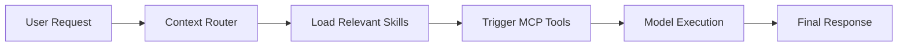

Modern AI agents have moved far beyond monolithic system prompts. If you want them to be reliable in production, you need a modular architecture where capabilities and context are loaded on demand instead of stuffed into one giant instruction block.

At the center of that shift is the **Model Context Protocol (MCP)**, an open standard for connecting models to external tools and data sources in a structured way.

A modern stack looks more like this:

**Agent -> Skills -> MCP Servers -> APIs**

- **Agent:** the runtime actor handling reasoning, routing, and execution.
- **Skills:** domain-specific procedures, standards, and task instructions.
- **MCP servers:** the integration layer exposing tools and data in a consistent format.
- **APIs:** the actual external systems behind those tools, such as GitHub, Jira, logs, or databases.

## Example project structure

Instead of cramming everything into one prompt, agent systems usually separate configuration, instructions, and integrations:

```text
.agent/
  agent.json
  context/
    architecture.md
    database-schema.md
  skills/
    pr-review.md
    deploy-check.md
  mcp/
    github-server.json
```

That separation lets the agent hydrate its context window only with the instructions and tools relevant to the task in front of it.

## Request flow



When a request comes in, the agent typically follows a lazy-loaded path:

1. **Context router:** decides what instructions and context are relevant.
2. **Skill loader:** pulls in the specific skill files for the task.
3. **MCP tools:** connects to the right MCP server to retrieve data or take an action.
4. **Model execution:** combines skills, returned tool data, and user intent to produce the result.

## Sample configuration

```json
{
  "agent_id": "internal-dev-assistant",
  "version": "1.2.0",
  "routing": {
    "default_model": "claude-3-7-sonnet",
    "fallback_model": "claude-3-5-sonnet"
  },
  "active_skills": [
    "repo-search",
    "deploy-checks"
  ],
  "system_context": [
    "context/architecture.md",
    "context/billing-api.md"
  ],
  "mcp_connections": {
    "github": "command: npx -y @modelcontextprotocol/server-github",
    "logs": "command: python mcp-datadog-server.py"
  }
}
```

The important design pattern is the separation of concerns:

- models handle reasoning
- skills define operating procedure
- MCP handles integrations
- external APIs remain replaceable behind the tool layer

Once those layers are separate, you can evolve one part of the system without destabilizing the rest. You can swap models, add new skills, or connect new tools without rewriting the entire agent architecture.
