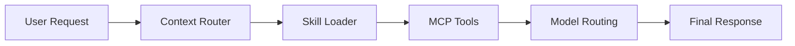

# Inside an MCP Agent Architecture

Modern AI agents are not just prompts.

A typical stack looks like:

Agent
→ Skills
→ Tools
→ APIs

## Example structure

agent.json  
context.md  
SKILL.md  

These components allow an agent to dynamically load capabilities.

## Request flow



## Sample config

```json
{
  "agent": "internal-dev-assistant",
  "skills": ["repo-search", "deploy-checks"],
  "context": ["context.md", "billing-api.md"],
  "tooling": ["mcp-github", "mcp-logs"]
}
```
