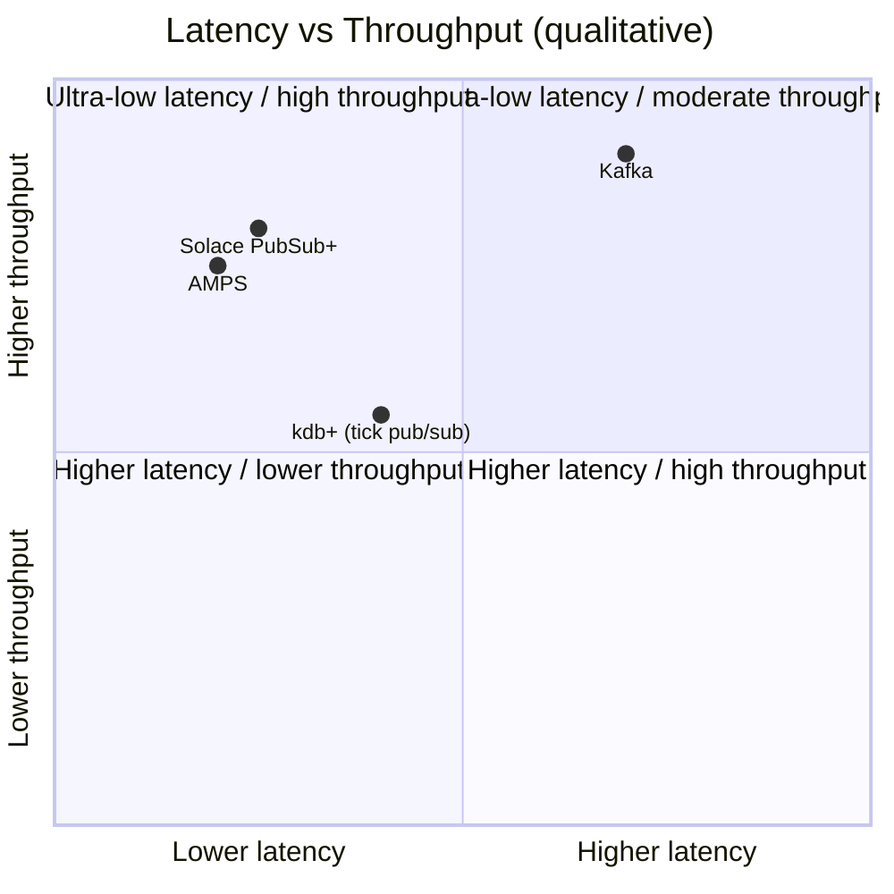
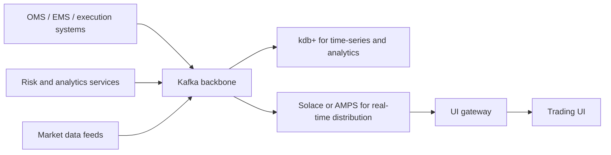
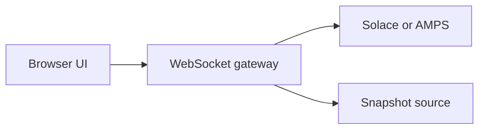

Trading UIs look simple on the surface.

A blotter, an order entry screen, or a positions dashboard is just a table with live data until you actually have to build one.

Then the real requirements show up:

- lots of subscribers
- per-user entitlements
- late joiners who need current state immediately
- continuous updates without crushing the browser
- replay when something goes wrong

That is why most serious trading environments end up with a two-layer design:

- a durable event backbone
- a UI-facing distribution layer

This is where Kafka, kdb+, Solace, and AMPS usually land.

## Executive summary

The short version:

- **Kafka** is best thought of as the durable event backbone.
- **kdb+** is the time-series and analytics engine.
- **Solace** is a UI-friendly event distribution layer with strong topic routing.
- **AMPS** is a high-performance pub/sub system with a very strong current-state model for live views.

If you try to use one of them for everything, you usually end up fighting the product.

## The core UI problem

Trading UIs need to solve several hard things at the same time:

- **Low latency** for fills, market data, positions, and order state
- **High throughput** when updates spike
- **Replayability** when someone needs to reconstruct what happened
- **Current state** for late joiners
- **Fine-grained filtering** by trader, book, account, or symbol
- **Fan-out** to many users and systems at once

Those requirements pull in different directions.

Durable logs are good at replay.
Pub/sub brokers are good at distribution.
Time-series engines are good at history and analytics.

Most funds end up using more than one.

## Comparison at a glance

| System | What it is | Best at | Usually weak at |
| --- | --- | --- | --- |
| Kafka | Durable distributed log | Replay, audit, cross-service fan-out, recovery | Browser-facing subscriptions, UI snapshots, fine-grained user filtering |
| kdb+ | Real-time + historical time-series engine | Tick storage, historical queries, analytics, replay tools | Acting as the main UI distribution bus |
| Solace | Topic-based event broker | Low-latency fan-out, routing, filtering, browser/mobile delivery | Being your historical analytics layer |
| AMPS | High-performance pub/sub + current-state server | Live views, stateful subscriptions, delta updates, replay | Broad ecosystem/tooling compared to Kafka |

That table is the practical version.

The chart below is intentionally qualitative. Exact placement depends on deployment choices, durability settings, batching, and gateway design.



## Kafka: the backbone

Kafka is excellent when the problem is:

- keep events durably
- replicate them
- let many consumers process them independently
- allow consumers to rewind and reprocess

That maps well to:

- order lifecycle events
- trade events
- audit logs
- risk pipelines
- downstream analytics

The consumer-offset model is a big part of why Kafka works so well as a backbone. Consumers control progress and can resume or replay from known positions.

Where Kafka is less natural for trading UIs:

- the UI usually wants current state, not just an event stream
- browsers do not speak Kafka directly
- per-user topic shaping and entitlement mapping are not really the product's core strength

That is why Kafka is usually behind the scenes rather than directly attached to the frontend.

## kdb+: the analytics and replay layer

kdb+ solves a different problem.

It is extremely strong for:

- tick storage
- real-time and historical query combinations
- replay tools
- charts
- PnL and microstructure analysis

Its classic architecture around tickerplant, RDB, and HDB is still one of the cleanest models for market-data capture and time-series analysis.

It is also important that the tickerplant logs data for recovery and can replay state into downstream processes.

For UI work, kdb+ is often the thing behind:

- charts
- historical views
- intraday analysis
- replay and diagnostics

It is not usually the best standalone answer for "how do I distribute live updates to thousands of browser sessions."

Even KX's own guidance acknowledges that GUI clients often should not get raw update rates directly, and chained tickerplants are a common way to bulk or throttle updates for UI consumption.

## Solace: the UI-facing event bus

Solace fits much closer to the real-time frontend problem.

Why:

- hierarchical topics
- wildcard subscriptions
- dynamic filtering
- built-in WebSocket support for browser clients
- direct vs guaranteed delivery modes
- broker-side features for slow consumers and throttling

That combination is very useful for trading UIs where one user needs:

- `orders.trader123.*`
- `marketdata.us.equities.aapl`
- `risk.book.alpha`

and another user should only see a different slice of the same event universe.

Solace's capital-markets UI guidance is pretty explicit here: HTML5 UIs usually want WebSockets, fan-out, filtering, caching, and strong entitlement control. That is much closer to the frontend problem than a raw Kafka topic is.

Two Solace concepts matter a lot for UI design:

- **Direct messaging** for very fast data where occasional loss is acceptable
- **Guaranteed messaging** for higher-value messages like orders and confirmations

That split maps nicely to trading:

- market data can often tolerate drop-and-replace behavior
- fills, cancels, rejects, and order acknowledgements usually cannot

## AMPS: pub/sub plus current state

AMPS is attractive for trading UIs because it combines several things that frontends need in one place:

- fast pub/sub
- current state tracking
- transaction-log replay
- content filtering
- WebSocket-capable JavaScript clients

The most important feature for UI work is SOW, or State of the World.

That gives you a very natural frontend pattern:

```text
give me current state
+ subscribe me for updates
```

That is close to exactly what a blotter needs.

A user opens the screen and wants:

- current open orders
- then incremental updates

not:

- replay every event since the morning
- reconstruct state in the browser

AMPS is unusually direct about this use case. SOW keeps current values by key, while the transaction log preserves the full publish history for replay and recovery.

That is why AMPS often feels more native for live UI views than Kafka does.

## The common hedge fund pattern

This is the architecture pattern that shows up over and over:



Why it works:

- Kafka handles durability and replay
- kdb+ handles history and analytics
- Solace or AMPS handles frontend distribution

This is usually cleaner than trying to make one product cover all three concerns.

## Snapshot plus stream is the real UI contract

The most important pattern in a trading UI is not just streaming.

It is:

1. get the current state
2. then subscribe to deltas

That is the real contract for:

- blotters
- order books
- positions views
- risk dashboards

Solace addresses that with cache or last-value style patterns.
AMPS addresses it very directly with SOW plus subscription.
Kafka can approximate parts of it with compacted topics plus application state, but it is not as naturally UI-shaped.
kdb+ can provide the snapshot via query, but you still need a good streaming path on top.

## Gateway design matters

The UI should almost never talk directly to the backbone.

A better pattern is:



That gateway usually owns:

- authentication
- entitlement checks
- subscription mapping
- backpressure
- coalescing
- protocol translation

This is where a lot of frontend reliability gets won or lost.

For example:

- market data can be coalesced aggressively
- fills and cancels usually should not be dropped
- entitlement logic should live here, not in the browser

If you skip this layer, the UI gets brittle fast.

## What blotters and order entry screens actually need

These systems tend to need four things:

### 1. Initial snapshot

Current orders, latest state, and maybe current positions.

### 2. Continuous deltas

Fills, status changes, market updates, and risk signals.

### 3. Fine-grained filtering

By trader, book, symbol, venue, client, or account.

### 4. Human-rate delivery

The backend might see thousands of updates per second.
The human should see what matters, at a rate the UI can actually render.

This is where Solace features like slow-consumer handling and message eliding matter.
It is also where kdb+ chained tickerplants and gateway-side batching make sense.

## A more practical way to choose

If you are deciding what to use, the question is usually not "which product wins?"

It is "which layer am I solving?"

### Use Kafka when:

- replay matters
- many downstream services need the same event stream
- you want durable logs and consumer-controlled offsets

### Use kdb+ when:

- you need tick storage
- historical + intraday analysis is central
- charts, replay, and analytics matter as much as live delivery

### Use Solace when:

- topic-based routing and entitlements matter
- the UI is a first-class consumer
- you need browser/mobile-friendly real-time distribution

### Use AMPS when:

- the UI wants current state plus stream in one model
- stateful subscriptions are central
- you want pub/sub and current-state storage tightly coupled

## If I were building this today

I would think in three tiers.

### Small team

- Kafka
- WebSocket gateway
- Redis or app-managed snapshot state
- ClickHouse, Timescale, or kdb+ if historical analytics matter

### Mid-sized trading platform

- Kafka backbone
- kdb+ for time-series and replay
- Solace or AMPS for UI distribution
- explicit gateway for auth, entitlements, and throttling

### Large multi-asset environment

- Kafka for the durable backbone
- kdb+ for storage and analytics
- Solace or AMPS for frontend distribution
- dedicated subscription managers, entitlement services, and broker-level ACLs

## The key insight

Kafka is a log.

kdb+ is a time-series engine.

Solace and AMPS are distribution systems.

Trading UIs usually need all three classes of behavior:

- history
- state
- streaming

Trying to force one product to be all of them usually creates pain somewhere else in the stack.

## Closing

The best trading platforms separate concerns cleanly:

- durability
- analytics
- distribution

Then they put a thin controlled layer between those backend systems and the UI.

That is usually what keeps the frontend fast, the backend sane, and the entire platform recoverable under real-world load.
