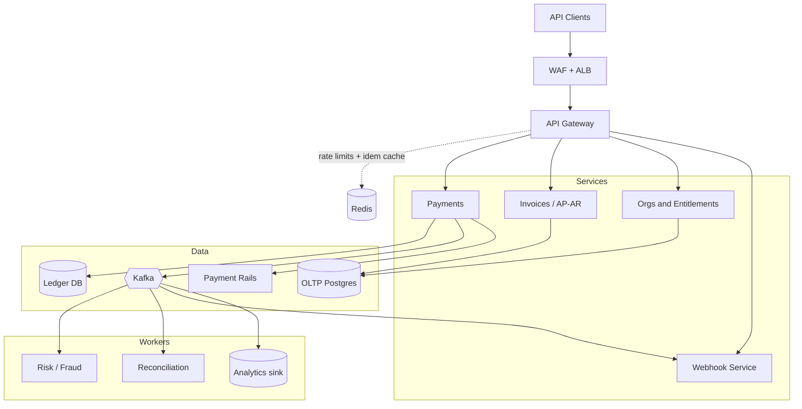

Most architecture posts stop at the diagram. This one goes further: we'll size a realistic B2B fintech platform from first principles, design the service architecture, and then price the whole thing on AWS — down to cost per transaction. All numbers are for a synthetic company, but the math is the math.

## The company we're building for

Assume a B2B payments platform with the profile of a mid-cap public fintech:

- **500,000 business customers**
- **35 million payment transactions per quarter** (~385K/day)
- **~$95B in quarterly payment volume**
- A public API used by accounting-software integrations, partner platforms, and direct developers

This is deliberately shaped like several real companies you could name. None of the numbers below are internal to any of them — everything is derived from the two public-style anchors above.

## Step 1: Derive the traffic, don't guess it

The most common capacity-planning mistake is pulling an RPS number out of the air. Derive it instead.

**API call volume.** Payment platforms are read-dominated. Every user-facing transaction drags a long tail of API calls behind it: list operations, delta polling from accounting-sync integrations, vendor lookups, status checks, webhook deliveries and their retries. A ratio of **~100 API calls per business transaction** is a defensible planning number for a sync-heavy B2B platform.

```
385,000 transactions/day × 100 calls/transaction ≈ 40M API calls/day
40,000,000 ÷ 86,400 seconds ≈ 460 RPS average
```

**Peak factor.** B2B fintech traffic is not flat. It's business-hours shaped, with nightly sync batch windows and violent month-end spikes (accounts-payable runs cluster on the 1st, 15th, and last business day). A peak-to-average ratio of 4–5× is typical:

```
460 RPS × 5 ≈ 2,300 RPS design peak
→ round to 2,500 RPS sustained, headroom to 3,500
```

**Sanity check.** 40M calls/day = 1.2B calls/month. At 5KB average response size that's ~6TB/month through the load balancer. Every downstream number in this post has to be consistent with these three: **460 avg RPS, 2,500 peak RPS, 1.2B calls/month.**

## Step 2: The architecture

Fintech constraints shape everything: money movement must be exactly-once *in effect* (idempotent, not magically exactly-once in transport), every state change must be auditable, and the blast radius of any failure must be contained. That pushes you toward a specific shape:



### The services, and why each one exists

**API gateway (thin, boring, critical).** Terminates auth (OAuth2 client credentials for machines, short-lived JWTs internally), enforces per-tenant rate limits (token bucket in Redis), and — the fintech-specific part — enforces **idempotency keys on every write**. A client retrying a `POST /payments` after an ambiguous timeout must get the original result, not a duplicate payment. The gateway checks the key against Redis before the request ever reaches the payments service. This one feature prevents the worst incident class the platform can have.

**Payments service + ledger.** Money movement is a state machine (`created → scheduled → processing → settled | failed | returned`), and the ledger that records it is **append-only, double-entry**. No `UPDATE balance SET ...`, ever. Balances are derived from entries; corrections are new offsetting entries. This is what makes reconciliation, audit, and "what happened at 2:14pm on March 3rd" answerable. Keep the ledger in its own database — its access patterns (append-heavy, sequential-scan reconciliation) and its compliance posture differ from the OLTP workload, and you never want a runaway invoice query starving ledger writes.

**Event backbone (Kafka).** Every state change is published as an event. Consumers — fraud scoring, reconciliation, webhooks, the analytics CDC sink — are decoupled from the write path. Two non-negotiable patterns:

1. **Transactional outbox.** The payments service writes the state change and the event to the *same* database transaction (outbox table), and a relay publishes to Kafka. This eliminates the "DB committed but event lost" dual-write bug — which in fintech means a payment that happened but nothing downstream knows about.
2. **At-least-once + idempotent consumers.** Don't chase exactly-once delivery in transport. Deliver at least once, and make every consumer idempotent (dedupe on event ID). Simpler, and it survives every failure mode.

**Webhook service.** Outbound webhooks are a product feature and an operational hazard. They need per-endpoint queues (one customer's dead server must not delay another's deliveries), exponential backoff with a retry schedule measured in hours, HMAC signing, and a redelivery UI. Treat this as its own service with its own SLOs.

**Payment-rails adapters.** Each external rail (ACH via NACHA files, RTP, card networks, wires) gets an isolated adapter service with its own circuit breaker. Rails fail independently and have wildly different latency profiles (ACH is a batch file; RTP is sub-second). Isolation means an ACH-window outage degrades one capability, not the platform.

**Risk/fraud scoring.** Consumes events, scores asynchronously for most flows, synchronously (with a tight latency budget and a fail-open-or-closed policy you choose *deliberately*) for high-risk actions like adding a new payee bank account.

### Cross-cutting decisions worth defending in a design review

- **Sync vs. async:** synchronous request/response only where the client needs the answer to proceed (create payment, fetch status). Everything else — notifications, scoring, reconciliation, search indexing — rides the event bus.
- **Multi-tenancy:** shared tables with a `tenant_id` on every row and enforced row-level security beats database-per-tenant until you have a compliance reason otherwise. Per-tenant rate limits and per-tenant cost attribution from day one.
- **Data retention:** ledger and audit events are immutable and retained for 7 years (cold storage after 18 months). Design the tiering up front; it dominates storage cost at year five.
- **Compliance surface:** PCI scope is minimized by never letting card PANs touch your services — tokenize at the edge via the processor. SOC 2 wants the audit log, access controls, and change management you already built for engineering reasons.

## Step 3: Capacity plan

For the API tier at 2,500 peak RPS, targeting 60% utilization at peak plus 2 pods of failure headroom, the runtime choice changes the fleet materially:

| Runtime | Per-pod capacity | Pod shape | Pods at peak | API-tier footprint |
|---|---|---|---|---|
| Java (Spring Boot, virtual threads) | ~500 RPS | 2 vCPU / 4 GB | 11 | 22 vCPU / 44 GB |
| Node (Fastify) | ~400 RPS | 1 vCPU / 1 GB | 13 | 13 vCPU / 13 GB |
| Python (FastAPI, async) | ~250 RPS | 1 vCPU / 1.5 GB | 19 | 19 vCPU / ~29 GB |

Why the profiles differ: the JVM buys the highest per-pod throughput with a high memory floor (heap must sit ~25% below the container limit or the OOM-killer wins) and a JIT warmup period that your HPA and readiness probes must respect. Node's event loop caps each pod at ~1 useful vCPU, and any synchronous CPU work — parsing a 5MB invoice list — blocks every in-flight request on that pod, so its failure mode is p99 spikes, not throughput collapse. Python's GIL means CPU work serializes per process; you scale with worker processes and each one is a full interpreter's worth of memory.

The API tier is only part of the cluster. Adding workers (sync, reconciliation, webhooks, fraud consumers), the rails adapters, and internal services, the whole platform lands around:

- **Steady state:** ~60 vCPU of pod requests
- **Peak:** ~140 vCPU
- **Average provisioned (with autoscaling):** ~96 vCPU → **12 × m7g.2xlarge** (8 vCPU / 32 GB, Graviton) average, bursting to ~20 nodes

## Step 4: The bill

Pricing below is AWS us-east-1, on-demand, mid-2026 list rates, production environment. Rates drift a few percent year to year; the *structure* of the bill is what matters.

### Production, monthly

| Component | Sizing | Math | Monthly |
|---|---|---|---|
| EKS worker nodes | 12 × m7g.2xlarge avg | 12 × $0.3264/hr × 730 | $2,859 |
| EKS control plane | 1 cluster | $0.10/hr × 730 | $73 |
| OLTP Postgres (RDS) | db.r6g.2xlarge Multi-AZ | ~$1.04/hr × 2 × 730 | $1,523 |
| OLTP read replicas | 2 × db.r6g.xlarge | 2 × $0.52/hr × 730 | $761 |
| OLTP storage | 2 TB gp3, Multi-AZ | 4,000 GB × $0.115 | $460 |
| Ledger Postgres (RDS) | db.r6g.xlarge Multi-AZ | ~$0.52/hr × 2 × 730 | $761 |
| Ledger storage | 1 TB gp3, Multi-AZ | 2,000 GB × $0.115 | $230 |
| Kafka (MSK) | 3 × kafka.m5.large | 3 × $0.21/hr × 730 | $460 |
| MSK storage | 3 TB | 3,000 GB × $0.10 | $300 |
| Redis (ElastiCache) | 3 × cache.r6g.large | 3 × $0.226/hr × 730 | $495 |
| ALB | 1.2B req/mo, ~6 TB processed | base + ~8 LCU avg | $65 |
| NAT gateways | 3 AZs + egress to rails | $98 + ~$25 data | $123 |
| WAF | 1.2B requests | 1,200M × $0.60/M + rules | $750 |
| Data transfer out | ~5 TB (webhooks, responses) | 5,000 GB × $0.09 | $450 |
| Observability (CloudWatch) | ~500 GB logs, metrics, traces | ingest + storage + alarms | $1,200 |
| S3, ECR, KMS, Secrets, misc | — | — | $350 |
| **Production total** | | | **~$10,860** |

### Full picture

| Environment | Monthly |
|---|---|
| Production | $10,860 |
| Staging + dev (~30% of prod) | $2,700 |
| **Total, on-demand** | **~$13,560 / month (~$163K / year)** |
| **With 1-yr Savings Plans + RIs** (≈40% off compute/DB) | **~$9,800 / month (~$118K / year)** |

Swap CloudWatch for Datadog at this scale (≈20 hosts, APM, 1TB+ logs) and observability alone jumps to $4–6K/month — often the second-largest line on a fintech's bill after the database tier. Budget for it consciously.

### Unit economics — the numbers that matter in the boardroom

```
11.7M transactions/month  →  $13,560 ÷ 11.7M  ≈  $0.0012 per transaction
1.2B API calls/month      →  $13,560 ÷ 1.2B   ≈  $0.000011 per API call
```

**Infrastructure costs ~0.12 cents per transaction.** If the platform monetizes anywhere near typical B2B payments take rates, infrastructure is a rounding error against transaction revenue — roughly 30–50 basis points of *revenue*, not of payment volume. This is the punchline of fintech infrastructure economics: the cloud bill is not your margin problem. Payment-rail costs, fraud losses, and compliance headcount are.

### What the bill's shape tells you

Three observations that generalize beyond this synthetic company:

**1. The database tier dominates.** OLTP + ledger + replicas + storage ≈ $3,700/month — 34% of prod. The compute fleet everyone argues about in design reviews is $2,900. Your cost-optimization energy belongs on data: right-sizing instances, aggressive storage tiering, and (the big one) not letting analytical queries run against OLTP, which forces you to oversize it. The CDC sink to a cheap analytics store pays for itself here.

**2. The runtime war is financially irrelevant.** The Java-vs-Node-vs-Python difference for the API tier is roughly $650 vs. $390 vs. $570/month in compute — under 5% of the total bill in every case. Choose the runtime for your team's fluency, hiring pool, and operational maturity. The fleet-size table matters for *operations* (deploy times, blast radius per pod), not for the invoice.

**3. Per-request charges scale linearly; fixed infra doesn't.** WAF, ALB LCUs, egress, and log ingest all grow with the 1.2B calls/month, and they're already ~$2,500 combined. At 10× traffic they're ~$25K/month while your (now reserved) databases maybe double. High-volume APIs eventually get killed by the per-request lines — which is why log sampling (keep 100% of errors, sample 1–5% of successes) and webhook payload discipline show up in every mature platform's cost review.

### The optimization ladder, in order of ROI

1. **Savings Plans / RIs on the always-on tier** (nodes, RDS, Redis, MSK): 35–45% off the biggest lines, zero engineering work.
2. **Graviton everywhere** (already assumed above): ~20% better price-performance vs. x86; the migration is usually a rebuild, not a rewrite.
3. **Spot for stateless workers** (sync, reconciliation, webhook retries): 60–70% off that compute; they're queue-driven and interruption-tolerant by design.
4. **Log sampling and retention tiers:** 50–80% off observability.
5. **Storage tiering on ledger/audit data:** move >18-month data to S3 Glacier tiers; at 7-year retention this compounds.

## Closing

The exercise generalizes: anchor on two public-shaped numbers (customers, transactions), derive traffic with an explicit calls-per-transaction ratio, let fintech's correctness constraints (idempotency, append-only ledger, outbox, isolated rails) dictate the architecture, and then price it honestly — including the non-prod environments and observability that most estimates forget. You end up with a platform that moves $95B a quarter on roughly $120K a year of reserved-rate cloud spend, and a bill whose shape tells you exactly where the next dollar of optimization lives.

